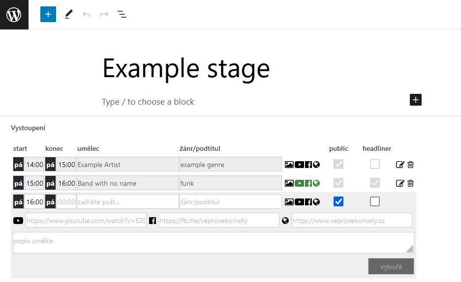

Festival stage management WordPress plugin
-
Within the stage's edit screen, admin can quick-add events and artists for the stage, which get generated on the fly.

Coded for Praha žije hudbou festival and other events managed by NerudnyFest, z.s.

The main editor php script is located in:
/plugins/tha-stage-type/tha-stage-type.php

Demo administration at http://wptimeline.fanky.eu/wp-admin/
**username**: wptimeline
**password**: (link to my linkedin profile without https://)

Live output on timeline: https://www.prahazijehudbou.cz/program/

Jakub Jelinek
www.linkedin.com/in/panfanky